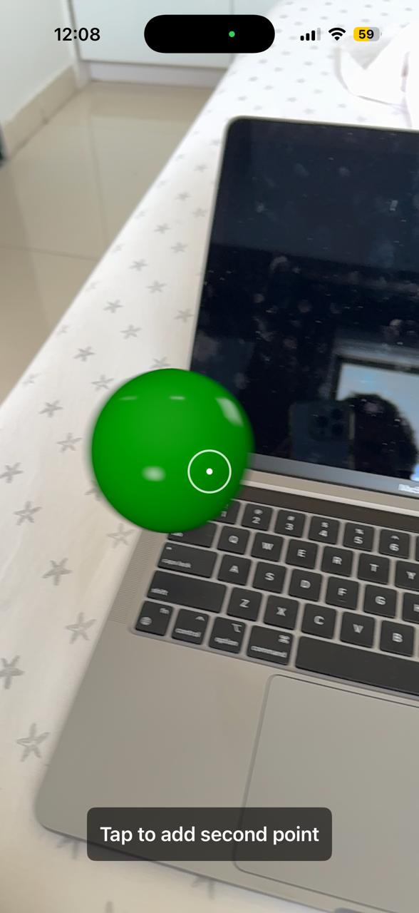
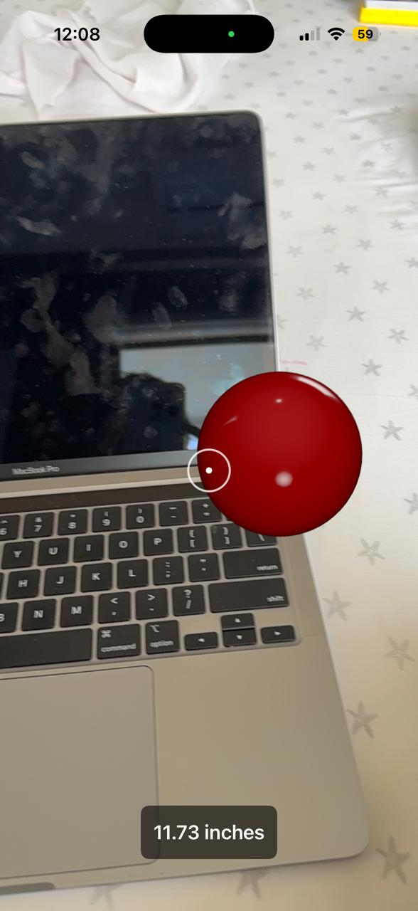

# AR Ruler — Real-World Measurement with ARKit & RealityKit

Measure physical objects instantly using augmented reality — no tape measure needed. Tap two points on any real-world surface and get the distance in inches, displayed live in AR.

---

## Demo

| First Point (Green) | Second Point + Result |
|---|---|
|  |  |

> Green sphere marks the start point. Red sphere marks the end point. Distance calculated instantly using `simd_distance` and displayed at the bottom.

---

## 🧠 What Makes This Interesting

Measuring physical objects is a common real-world problem — real estate, interior design, furniture placement. This app solves it using:

- **ARKit raycasting** to convert a 2D screen tap → exact 3D world coordinate
- **RealityKit 3D spheres** anchored at real-world positions as visual markers
- **`simd_distance`** for precise 3D Euclidean distance calculation
- **Auto-reset on background** via SwiftUI `ScenePhase` — session restarts cleanly every time

No third-party dependencies. Pure Apple frameworks only.

---

## ⚙️ Tech Stack

| Layer | Technology |
|---|---|
| AR Framework | ARKit, RealityKit |
| UI | SwiftUI, `UIViewRepresentable` |
| Plane Detection | Horizontal + Vertical planes |
| 3D Math | `simd_distance`, `SIMD3<Float>` |
| State Management | `@State`, `@Environment(\.scenePhase)` |
| Bridge | `UIViewRepresentable` (ARView inside SwiftUI) |

---

## 🔧 How It Works

**Step 1 — Tap first point**
```swift
let results = view.raycast(from: location, allowing: .estimatedPlane, alignment: .any)
let position = SIMD3<Float>(first.worldTransform.columns.3.x,
                             first.worldTransform.columns.3.y,
                             first.worldTransform.columns.3.z)
```
ARKit raycasts from screen tap → returns exact 3D world position. Green sphere placed at start point.

**Step 2 — Tap second point**

Red sphere placed at end point. Distance calculated immediately:
```swift
let dist = simd_distance(startPos, endPos)
let inches = dist * 39.3701
self.parent.distanceText = String(format: "%.2f inches", inches)
```

**Step 3 — Auto reset**
```swift
if scenePhase == .background {
    context.coordinator.resetMeasurement(on: uiView)
    runSession(on: uiView)
}
```
When app goes to background, all anchors are removed and AR session resets cleanly — ready for a fresh measurement on return.

---

## 🏗️ Architecture

```
ContentView (SwiftUI)
├── ARRulerView (UIViewRepresentable)
│   └── Coordinator (ARSessionDelegate)
│       ├── handleTap() — raycasting + sphere placement
│       └── resetMeasurement() — session cleanup
└── ScenePhase observer — background reset trigger
```

Clean separation between SwiftUI state and ARKit/RealityKit logic via `UIViewRepresentable` + `Coordinator` pattern.

---

## 🚀 How to Run

1. Clone the repo
2. Open `AR Ruler.xcodeproj` in Xcode
3. Connect a **physical iPhone** — ARKit does not run on Simulator
4. Select your development team under Signing & Capabilities
5. Build & Run → point camera at any flat surface → tap two points

**Requirements:**
- iOS 16+
- Xcode 15+
- Physical device with A12 chip or later
- Camera permission (prompted on first launch)

---

## 📂 Project Structure

```
AR Ruler/
├── ContentView.swift       # SwiftUI view + ARRulerView bridge + ScenePhase handling
└── Info.plist              # Camera usage description
```

---

## 🔮 Possible Extensions

- Draw a line between the two measurement points in AR
- Support multiple measurements simultaneously
- Add cm / mm unit toggle
- Export measurement history

---

## 👨‍💻 Author

**Hiren Mistry** — iOS Developer  
[GitHub](https://github.com/Hiren125) · [LinkedIn](https://www.linkedin.com/in/hm108/)
